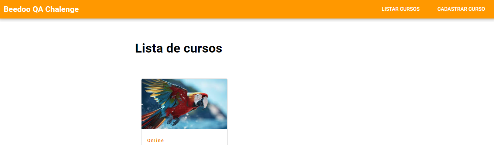

# BEEDOO - Desafio | Analista de Qualidade de Software Júnior

 
> Projeto realizado durante o desafio para **Analista de Qualidade de Software Júnior** da **BEEDOO**.
 
## 📚 Tópicos

- Plano de Teste (Gherkin) ( )
- Plano de Teste (Step by Step / Passo a Passo) (https://docs.google.com/spreadsheets/d/17pnGn8KU46g3Z_fXnm6Wrzy2rzANGnhW1ctL13n2PuQ/edit?usp=drive_link)
- Teste manual (Execução, Evidências e Sugestões) ( )

## 📖 User Stories (Documentação)

- Listagem de cursos
  - `O sistema deve puxar os dados corretos do banco de dados e exibir da maneira correta. 

- Cadastro de cursos
  - `O sistema deve cadastrar corretamente os cursos com todos os dados inseridos nas opções obrigatórias e NÃO obrigatórias existentes no formulário.`
  - `Um curso NÃO deve ser cadastrado sem nome, porque sem o nome do curso não é possível identificá-lo.`
  - `Um curso deve ser cadastrado sem descrição, porque não interfere na usabilidade do sistema nem no aspecto visual.`
  - `Um curso deve ser cadastrado sem instrutor, porque um curso pode durar para sempre ou por muito tempo e pode ter vários instrutores ao longo do tempo e não inserir um instrutor fixo não interfere na usabilidade do sistema nem no aspecto visual.`
  - `Um curso NÃO deve ser cadastrado sem imagem de capa, porque um produto sem imagem de capa fica esteticamente feio, e isso influencia na percepção de qualquer usuário ao utilizar o sistema.`
  - `Um curso deve ser cadastrado sem data de início, porque um curso pode durar para sempre ou por muito tempo e ter usuários iniciando o tempo todo e não inserir uma data de início do curso não interfere na usabilidade do sistema nem no aspecto visual.`
  - `Um curso deve ser cadastrado sem data de fim, porque um curso pode durar para sempre e não inserir uma data de fim do curso não interfere na usabilidade do sistema nem no aspecto visual.`
  - `Um curso NÃO deve ser cadastrado sem número de vagas, porque um número de vagas infinito pode ocasionar uma queda ou lentidão exagerada no sistema por sobrecarga de acessos simultâneos, dependendo da capacidade de processamento do servidor web e da infraestrutura onde está inserido.`
  - `Um curso NÃO deve ser cadastrado sem número de vagas, porque é preciso ter acesso ao endereço ou formulário de inscrição para que o usuário tenha possibilidade de acessar o curso efetivamente.`
  - `Um curso NÃO deve ser cadastrado sem número de vagas, porque é preciso ter acesso ao endereço ou formulário de inscrição para que o usuário tenha possibilidade de acessar o curso efetivamente.`
  - `Um curso NÃO deve ser cadastrado sem Link de inscrição, porque é preciso ter acesso ao formulário de inscrição para que o usuário tenha possibilidade de acessar o curso efetivamente.`
  - `Um curso NÃO deve ser cadastrado sem Endereço, porque é preciso ter acesso ao endereço para que o usuário tenha possibilidade de acessar o curso efetivamente.`

## 🔗 Contato

mykallella@gmail.com
